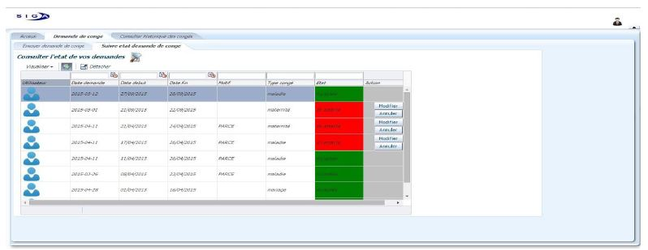

# LEAVE MANAGEMENT-SIGA
> leave management for the employees of SIGA.


Developed with oracle ADF framework.



## Installation


Windows:

```sh
git clone https://github.com/Oussemalaamiri/OracleADf-Leave-management.git
```

## Usage example

An Employee send a leave request to be treated by both of the human resource management and the director.

